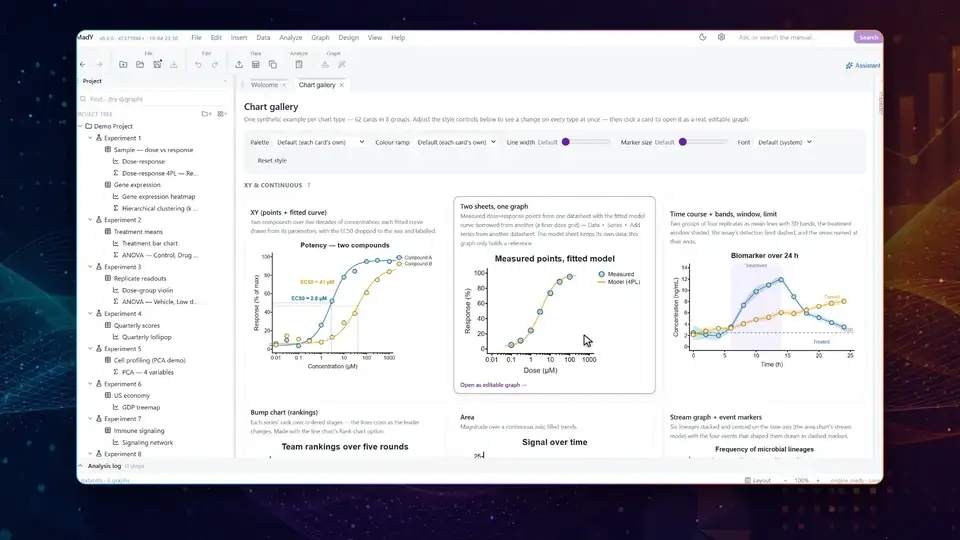
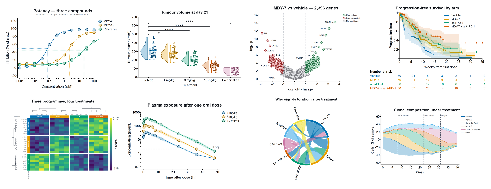
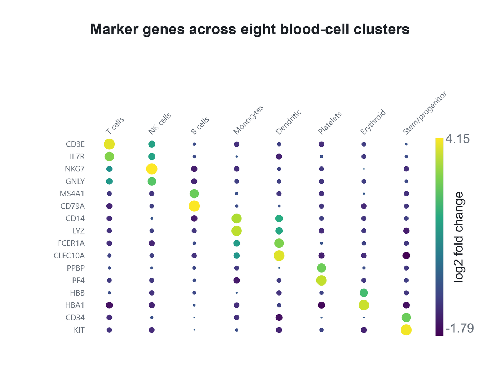
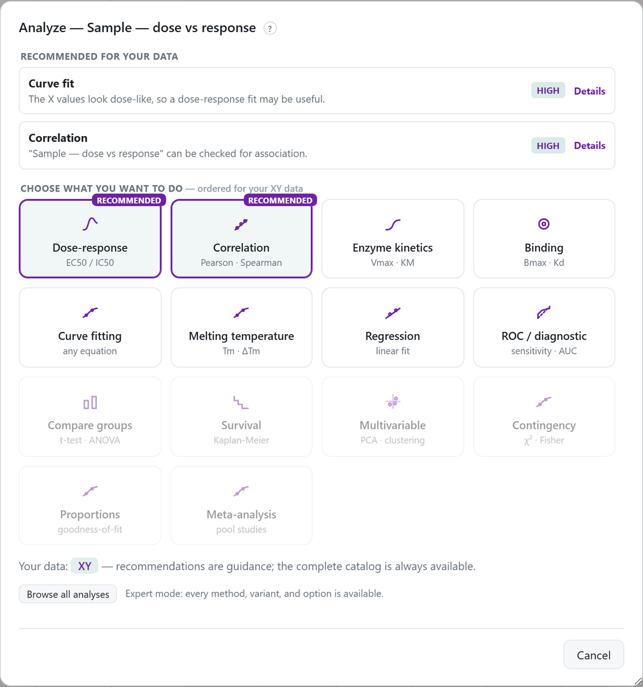
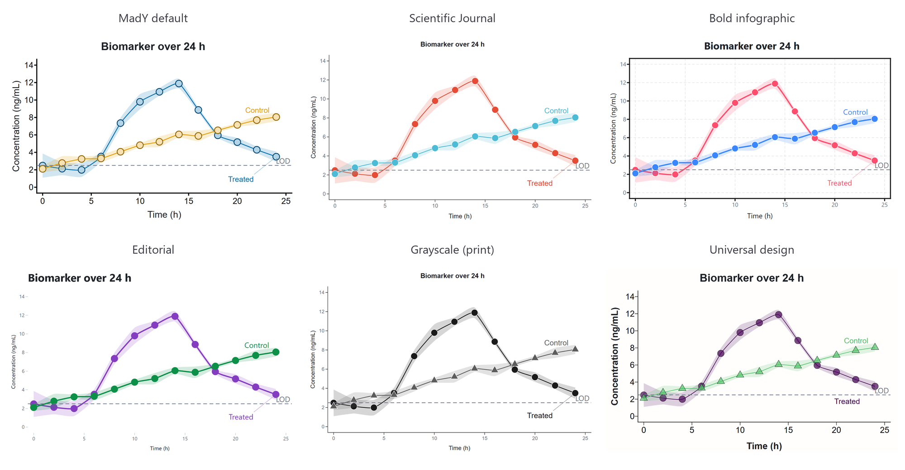

<p align="center">
  
</p>

# MadY

**A scientific graphing and statistics desktop application: a fully editable vector document
model with a validated statistics engine, built to run entirely offline.**

<p align="center">
  <a href="docs/readme/videos/mady-promo.mp4"></a><br>
  <sub>Click for the full video, narrated (1:20, MP4, 10.6 MB).</sub>
</p>

---

## What MadY is

MadY lets a scientist go from a data table to a publication-ready, fully-editable figure — with
correct, trustworthy statistics behind every graph — without writing code.

**MadY is a vector-graphics editor for charts, with a reactive data → analysis → graph pipeline
and a statistics engine.** Charts are not
opaque images produced by a library; every element (axis tick, error bar, data point, annotation)
is an addressable, styleable object in a document you own. That is what makes "fully editable",
"homogeneous design" and "figure-panel assembly" achievable rather than bolted on.

**Local and offline by design.** No account, no telemetry, no cloud: your data and your figures stay on your computer.

## Design principles

> **Above all, easy to use.** A modern, responsive, intuitive interface is the product, not a
> wrapper around it. A scientist should be productive in
> minutes: smart defaults and progressive disclosure, a guided "which test should I use?" flow,
> plain-language result explanations, a command palette, live preview, drag-and-drop, and
> first-class undo. Every principle below serves this one.

1. **Own the document.** Every visual element is part of a versioned document that is saved and
   reopened whole. No element is off-limits to editing.
2. **Statistics you can trust.** Peer-reviewed numerical libraries (SciPy, statsmodels) behind a
   tidy result contract, and an independent cross-check (`engines/py/crosscheck.py`, over 1,300
   checks that recompute every statistic by different means) in the test suite. A subtly-wrong
   p-value is worse than a missing feature.
3. **Beautiful by default, tunable to the pixel.** Sensible modern defaults; complete control when
   you want it.
4. **Design consistency is a first-class feature.** Style presets, kind defaults and "apply this
   look" make a multi-panel paper look like one coherent piece.
5. **Free and open source.** Free to use, study, change and share under the GNU GPL (version 3
   or later). No licence fee, no account, no subscription.

## What it does today

<p align="center">
  <br>
  <sub>Eight of the graph types, each drawn by MadY from made-up data.</sub>
</p>

- **15 datasheet formats.** Eight general formats (XY, Column, Grouped, Contingency, Survival, Parts
  of whole, Multiple variables, Nested), a dedicated PCA / ordination format, and six drawing formats
  for figures that have no natural home in an XY table: Set membership (Venn / UpSet), Subject
  timeline (swimmer), Meta-analysis (forest / funnel, with pooling and publication-bias methods),
  Network edge list (network / chord), GWAS association results (Manhattan / QQ) and Genomic
  alterations (oncoprint). The format is what unlocks the analyses — a drawing format refuses the
  statistics that would be wrong on it.
- **Over 50 graph types**, every part of each one editable: XY, line and area plots, bars and columns,
  box, violin and raincloud plots, histograms, survival curves, ROC, forest and funnel plots,
  Bland–Altman, volcano, Manhattan and QQ plots, heatmaps and correlation matrices, networks and
  chord diagrams, Venn and UpSet diagrams, treemaps and sunbursts, 3-D scatter, and PCA score,
  loading and biplots, plus combinations such as bars with a line on a second axis, histogram with
  density, Pareto and waterfall charts.
- **49 analysis methods** (about 150 configured variants) in the Analyze dialog: descriptives and
  normality, t tests, equivalence (TOST), Bayes factors and permutation tests, the ANOVA family
  (one-, two- and multi-factor, repeated-measures, mixed, nested, ANCOVA), contingency and
  goodness-of-fit, correlation and regression (linear, multiple, logistic, Poisson), ~110-model
  nonlinear curve fitting with global fits, model comparison and interpolation, survival
  (Kaplan–Meier, log-rank, Cox), ROC and AUC, method comparison (Deming, Passing–Bablok,
  Bland–Altman), PCA, correlation matrix and clustering, the ordinations (principal coordinates
  on any distance, NMDS with its stress and Shepard diagram, correspondence analysis, and the
  three constrained ordinations — redundancy analysis, canonical correspondence analysis and
  distance-based RDA, each with permutation tests of the model and of every term, and both LC
  and WA site scores), variance partitioning across two or three blocks of explanatory
  variables, outliers, a P-value corrector, and meta-analysis with publication bias. Every result leads with the answer, offers a graph, and
  drafts a Methods paragraph.
- **Reactive document.** Change the data and the graphs drawn from it redraw at once, derived
  sheets recompute, and the analyses built on it are marked out of date until you re-run them;
  every mutation is undoable; derived sheets follow their source columns through inserts and deletes.
- **Import** from delimited and whitespace text (.csv, .tsv, .txt, .dat, .prn), JSON and NDJSON,
  Excel (.xlsx) and the older .xls / .xlsb / .ods workbooks (every sheet at once), and the data
  tables of `.pzfx` files — with a real-grid preview, skip rows, comment markers, units rows,
  missing-value tokens, thousands separators, cell ranges, append-to-existing, transposition, and
  tables that stay linked to a file that keeps changing.
- **Export** to PNG, JPEG, TIFF (CMYK), SVG, PDF and interactive HTML at journal print widths;
  results to CSV / Excel; a reproducible Python script and a provenance bundle; printing.
- **Figure assembler**: multi-panel figures with lettering, alignment by axes, row and column
  spans, a layout picker, shared axes, a merged legend, image panels and saved house styles.
- **A headless MCP server** (`packages/mcp-server`) so a coding agent can drive a document over
  stdio through the same typed, undoable command API the UI uses.

<p align="center">
  <br>
  <sub>A dot plot of marker genes across cell clusters (made-up data).</sub>
</p>

<p align="center">
  <br>
  <sub>Analyze recommends methods for your data; every method stays one click away.</sub>
</p>

<p align="center">
  <br>
  <sub>One graph in each of the six built-in style presets.</sub>
</p>

## Installation

**Windows 10 or 11, 64-bit.** MadY comes in two forms from [Releases](../../releases): an
installer and a portable version. Both hold the same program, its statistics engine included;
there is nothing else to install.

MadY is not code-signed, so the first time it starts Windows shows an unknown-publisher notice:
click **More info**, then **Run anyway**.

### Installer

1. Download `MadY-Setup-<version>.exe`.
2. Double-click it. MadY installs for your user only, without administrator rights, adds itself to
   the desktop and the Start menu, and opens `.mady` project files on a double-click.

To update, run the new installer; your projects and settings are kept. To uninstall, use
**Settings ▸ Apps ▸ MadY**.

### Portable version

1. Download `MadY-<version>-win-portable.zip`.
2. Right-click it and choose **Extract All…**, then pick a folder (a USB stick works too). Run it
   from the extracted folder, not from inside the zip.
3. Open that folder and double-click `MadY.exe`.

Nothing is installed: there is no Start-menu entry, and `.mady` files are opened from
**File ▸ Open…**. To remove it, delete the folder. Settings are kept in your Windows user profile,
shared with an installed copy.

### macOS (Apple Silicon), experimental

For Macs with an Apple chip (M1 or later), macOS 12 or later.

1. Download `MadY-<version>-arm64.dmg`.
2. Open it and drag **MadY** into **Applications**.
3. The first time, macOS blocks MadY because it is not signed with an Apple developer certificate:
   open **System Settings ▸ Privacy & Security**, scroll down and click **Open Anyway**.

## Repository layout

```
packages/contracts   wire types for the stats protocol (dependency-free)
packages/core        the document model — Project / DataTable / Plot / Analysis, undo, import maths
packages/graphics    buildPlotScene(): (table, plot) → pixel geometry for every chart kind
packages/mcp-server  headless MCP server over the document
apps/desktop         the Electron app: main process, preload bridge, React renderer
engines/py           the Python statistics engine (engine.py) and its independent oracles
e2e · e2e-electron   Playwright tests of the built renderer, and of the real app
scripts · tools      the manual's pictures and videos, the third-party notices, the
                     preview server for the e2e tests
docs                 the Windows build guide, the README's media, the ggplot importer's
                     example scripts
```

## Build, test, run

Prerequisites: Node 24+, and Python 3 (`py -3` on Windows) with the engine's packages:
`py -3 -m pip install -r engines/py/requirements.txt -r engines/py/requirements-dev.txt`.

```bash
npm ci
npx vitest run && npm run typecheck && npm run typecheck:tests && cd apps/desktop && npx tsc --noEmit && npx electron-vite build
```

- Run the real app: `cd apps/desktop && npm run dev`.
- End-to-end: `npm run e2e` from the repo root (builds the renderer first).
- Windows installer: `cd apps/desktop && npm run freeze-engine && npm run dist` — see
  [`docs/BUILD-WINDOWS.md`](docs/BUILD-WINDOWS.md). The engine must be re-frozen whenever
  `engine.py` or its dependencies change.

## Platforms

Released builds are for Windows (installer and portable version) and, experimentally, for macOS on
Apple Silicon. Each carries its own statistics engine, with no separate Python to install.

## Licence

MadY is free software: you can redistribute it and/or modify it under the terms of the
**GNU General Public License** as published by the Free Software Foundation, either version 3
of the License, or (at your option) any later version. The full text is in [`LICENSE`](LICENSE).
Third-party components are under their own permissive licences (MIT / BSD / ISC / PSF); see
[`THIRD-PARTY-NOTICES.md`](THIRD-PARTY-NOTICES.md). The example R scripts used to test the
ggplot2 importer come from the ggplot2 documentation and the R Graph Gallery, both MIT; see
[`docs/ggplot-corpus/NOTICE.md`](docs/ggplot-corpus/NOTICE.md). The *Universal design* style
preset follows the accessibility-first defaults of the ggplotplus R package by Dr Alex Bajcz (MIT). The
ridgeline's horizon fold follows BiomeHorizon, an R package from Ran Blekhman's laboratory. No code
is reused.

MadY was developed with the help of Claude models (Anthropic).

Copyright © 2026 Mikael Elias.

It is distributed in the hope that it will be useful, but **WITHOUT ANY WARRANTY** — without
even the implied warranty of MERCHANTABILITY or FITNESS FOR A PARTICULAR PURPOSE. See the GNU
General Public License for more details.

### Your figures are yours

Figures, files and results you produce with MadY are **yours entirely**. A program's output
is not a derivative work of the program, so nothing in the GPL attaches to your data, your
figures or your paper — publish, sell or license them exactly as you would if you had drawn
them by hand. No watermark, no attribution requirement, no conditions.

### Citing MadY

Appreciated when it helped with published work:

> Elias, M. (2026). MadY (version 0.6.1). https://doi.org/10.5281/zenodo.23178166

Machine-readable metadata is in [`CITATION.cff`](CITATION.cff).

## Status

MadY is in beta: **v0.6.1** (2026-10-06). It may contain bugs, and I will fix them as they are
reported. Check any statistics you publish against an established statistics package. The manual
is inside the program: **Help ▸ Documentation**, or F1.

If something goes wrong, choose **Help ▸ Report a bug…**: it gathers a short report (versions, the
graph on screen, recent errors and clicks, with file paths removed and never your data unless you
tick it) and opens your e-mail ready to send, or saves it as a .zip. You can also open an issue on
GitHub.
